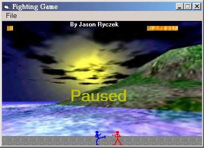

<div align="center">

## A Cool Fighting Game Example \- Version 1\.00


</div>

### Description

This game is really cool, and great for someone who's looking for how to make a fighting game with BitBlt, LoadDC, GenerateDC and other API calls. The Sprites are kinda bad, and there isn't any sound. But it can all be changed and added easily. Enjoy! Please Rate.
 
### More Info
 


<span>             |<span>
---                |---
**Submitted On**   |2001-04-13 14:24:20
**By**             |[Jason Ryczek](https://github.com/Planet-Source-Code/PSCIndex/blob/master/ByAuthor/jason-ryczek.md)
**Level**          |Beginner
**User Rating**    |3.3 (20 globes from 6 users)
**Compatibility**  |VB 6\.0
**Category**       |[Games](https://github.com/Planet-Source-Code/PSCIndex/blob/master/ByCategory/games__1-38.md)
**World**          |[Visual Basic](https://github.com/Planet-Source-Code/PSCIndex/blob/master/ByWorld/visual-basic.md)
**Archive File**   |[A Cool Fig183344132001\.zip](https://github.com/Planet-Source-Code/jason-ryczek-a-cool-fighting-game-example-version-1-00__1-22385/archive/master.zip)

### API Declarations

```
' Here is whats in modGame.bas
' sorry, but I forgot to put it in the zip file
' and I can't do it from my house, so to get
' this program to work, you need to add
' this to a module, and give it the above name.
Option Explicit
Public Declare Function BitBlt Lib "gdi32" (ByVal hDestDC As Long, ByVal X As Long, ByVal Y As Long, ByVal nWidth As Long, ByVal nHeight As _
 Long, ByVal hSrcDC As Long, ByVal xSrc As Long, ByVal ySrc As Long, ByVal dwRop As Long) As Long
Public Declare Function SelectObject Lib "gdi32" (ByVal hdc As Long, ByVal hObject As Long) As Long
Public Declare Function CreateCompatibleDC Lib "gdi32" (ByVal hdc As Long) As Long
Public Declare Function DeleteDC Lib "gdi32" (ByVal hdc As Long) As Long
Public Declare Function LoadImage Lib "user32" Alias "LoadImageA" (ByVal hInst As Long, ByVal lpsz As String, ByVal un1 As Long, ByVal n1 As _
Long, ByVal n2 As Long, ByVal un2 As Long) As Long
Public Declare Function DeleteObject Lib "gdi32" (ByVal hObject As Long) As Long
Const IMAGE_BITMAP As Long = 0
Const LR_LOADFROMFILE As Long = &H10
Const LR_CREATEDIBSECTION As Long = &H2000
Const LR_DEFAULTSIZE As Long = &H40
'IN: FileName: The file name of the graphics
'OUT: The Generated DC
Public Function GenerateDC(ByVal FileName As String) As Long
Dim DC As Long
Dim hBitmap As Long
'Create a Device Context, compatible with the screen
DC = CreateCompatibleDC(0)
If DC < 1 Then
 GenerateDC = 0
 Exit Function
End If
'Load the image....BIG NOTE: This function is not supported under NT, there you can not
'specify the LR_LOADFROMFILE flag
hBitmap = LoadImage(0, FileName, IMAGE_BITMAP, 0, 0, LR_DEFAULTSIZE Or LR_LOADFROMFILE Or LR_CREATEDIBSECTION)
If hBitmap = 0 Then 'Failure in loading bitmap
 DeleteDC DC
 GenerateDC = 0
 Exit Function
End If
'Throw the Bitmap into the Device Context
SelectObject DC, hBitmap
'Return the device context
GenerateDC = DC
'Delte the bitmap handle object
DeleteObject hBitmap
End Function
Public Function DeleteGeneratedDC(ByVal DC As Long) As Long
If DC > 0 Then
 DeleteGeneratedDC = DeleteDC(DC)
Else
 DeleteGeneratedDC = 0
End If
End Function
```


